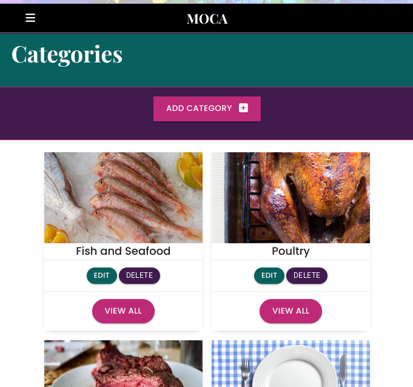

# [M.O.C.A- My Own Cooking App](https://your-project-link-here)

Welcome to **MOCA**! All the recipes you and your family love, all in one place! M.O.C.A (My Own Cooking App) is a simple ad easy to use app I made formyself to quicky access my favourite recipes without having to search through the myriad of books, online and pinterest pages to find their details. Recipes can be added simply and searched by category or by ingredient and viewed at the click of a button!

- This project was completed for the Milestone 3 project in Level 5 Web Application and Development. specifically the **Data Centric Development** module. The purpose for this milestone project is to "*Create a web application that allows users to store and easily access recipes*", using the **CRUD** operations of **C**reate, **R**ead, **U**pdate, and **D**elete for their recipes.

---

## Table of Contents
1. [**UX**](#ux)
    - [**User Stories**](#user-stories)
    - [**Design**](#design)
        - [**Framework**](#framework)
        - [**Color Scheme**](#color-scheme)
        - [**Icons**](#icons)
        - [**Typography**](#typography)
    - [**Wireframes**](#wireframes)

2. [**Testing**](#testing)
    - [**Validators**](#validators)
    - [**Compatibility**](#compatibility)
    - [**Known Issues**](#known-issues)

3. [**Features**](#features)
    - [**Existing Features**](#existing-features)
    - [**Features Left to Implement**](#features-left-to-implement)

4. [**Technologies Used**](#technologies-used)
    - [**Front-End Technologies**](#front-end-technologies)
    - [**Back-End Technologies**](#back-end-technologies)

5. [**Deployment**](#deployment)
    - [**Local Deployment**](#local-deployment)
    - [**Remote Deployment**](#remote-deployment)

6. [**Credits**](#credits)
    - [**Content**](#content)
    - [**Media**](#media)
    - [**Code**](#code)
    - [**Acknowledgements**](#acknowledgements)

---

## UX

This project is a personal endeavor to create a platform for managing recipes. The goal is to provide a user-friendly interface where the user can easily add, view, and manage recipes while enjoying a clean, tidy and intuitive design.

### User Stories

"**_As a user, I would like to_** _____________________________"

:white_check_mark: *denotes items that have been successfully implemented*

- ✅ *view the site* from **any device** *(mobile, tablet, desktop)*.
- ✅ *view all recipes*.
- ✅ *search for recipes* by **category**.
- ✅ *search recipes* by **name** or **ingredients**.
- ✅ *view a single recipe* with **details** including **ingredients** and **instructions**.
- ✅ *add* new recipes with **name, description, ingredients, instructions, and image**.
- ✅ *edit* existing recipes and categories.
- ✅ *delete* recipes and categories.
- ✅ *upload an image* for each recipe.
- ✅ *view* recipes with a **clean layout** and **responsive design**.
- ✅ *ensure* at least one step is added when creating a recipe.

### Design

**Framework**: Utilizes **Bootstrap** and **Materialize** for responsive design and UI components.

**Color Scheme**: Employs a warm and inviting color palette suitable for food-related content. 

### Color Usage

- **Main Color (`#0A605F`)**: This rich teal color is used for the background of the header and footer, as well as key elements like the navigation bar. It helps to establish a cohesive and visually appealing theme across the application.
- **Secondary Color (`#F44336`)**: This vibrant red is used for borders, highlights, and buttons. It adds a striking contrast to the main color and draws user attention to interactive elements.
- **White (`#fff`)**: White is used for text on dark backgrounds and as the background color for certain sections. It ensures that text is easily readable against darker colors and provides a clean look.
- **Black (`#000`)**: Black is used for text and navigation backgrounds to enhance readability and provide a strong contrast with lighter elements.

This color scheme is designed to be both visually appealing and functional, ensuring that the application's interface is user-friendly and aesthetically consistent.

**Icons**: Uses icons from **FontAwesome** for visual enhancements.

**Typography**: 

- The typography for the Recipe App is designed to prioritize readability, clarity, and a modern aesthetic, enhancing the overall user experience.

1. **Font Family**: The primary font used is "Poppins", a sans-serif font, which provides a clean, contemporary look. For headings, the "Playfair Display" serif font is used, adding a touch of elegance and sophistication to the design. These choices ensure that the text is legible across all devices and browsers, while also giving the app a distinctive style.

2. **Font Weight**: A variety of font weights are used throughout the app to create visual hierarchy and emphasis. Bold weights are employed for headings (h1, h2, h3) to draw attention and make key sections stand out. Lighter weights are used for body text, maintaining a comfortable reading experience without overwhelming the user.

3. **Consistency**: Consistency in typography is maintained across the entire app to ensure a cohesive and unified design. The same font families, weights, and sizes are used throughout various sections, contributing to a harmonious and professional visual aesthetic. This consistency also reinforces the app's branding and enhances user navigation by providing a familiar visual structure.

By carefully selecting and applying these typography principles, the Recipe App not only looks visually appealing but also ensures that users can easily read and interact with the content.

## Wireframes
I used [Balsamiq Wireframes](https://balsamiq.com/wireframes/) to create wireframes before starting the project to help me plan the layout and flow of the project. 
When I was creating my website, the design plan was changed but only small placement changes.

 ### Homepage Wireframes

- [**Desktop**](./docs/wireframes/wf-homepage-desktop.png)
- [**Tablet**](./docs/wireframes/wf-homepage-tablet.png)
- [**Mobile**](./docs/wireframes/wf-homepage-mobile.png)

 ### Categories page Wireframes

- [**Desktop**](./docs/wireframes/wf-categories-desktop.png)
- [**Tablet**](./docs/wireframes/wf-categories-tablet.png)
- [**Mobile**](./docs/wireframes/wf-categories-mobile.png)

### Search Results page Wireframes

- [**Desktop**](./docs/wireframes/wf-search-results-desktop.png)
- [**Tablet**](./docs/wireframes/wf-search-results-tablet.png)
- [**Mobile**](./docs/wireframes/wf-search-results-mobile.png)

### View Recipe page Wireframes

- [**Desktop**](./docs/wireframes/wf-view-recipe-desktop.png)
- [**Tablet**](./docs/wireframes/wf-view-recipe-tablet.png)
- [**Mobile**](./docs/wireframes/wf-view-recipe-mobile.png)

### Add/edit Category page Wireframes

- [**All**](./docs/wireframes/wf-add-update-category-all.png)

### Add/edit Recipe page Wireframes

- [**All**](./docs/wireframes/wf-add-update-recipe-all.png)

---

## Testing
### Accessibility Testing
- **Accessibility Testing**: Ensures the site is accessible to all users, including those with disabilities.

| Test Case ID | Test Description                                                                                             | Expected Result                                                                                       
|--------------|-------------------------------------------------------------------------------------------------------------|-------------------------------------------------------------------------------------------------------|
| AT-01        | Verify the website meets accessibility standards (e.g., chrome DevTools, lighthouse)                                            | Website meets accessibility standards, ensuring it is usable by people with disabilities Accessibility score in the green (90-100)              |

### Desktop Lighthouse Test Results

| Page | Home | Categories | Add Recipe | Edit Recipe | Add Category | Edit Category | View Search Results | View Recipe |
|----------|----------|----------|----------|----------|----------|----------|----------|----------|
| Scores    | Acessibility- 100   Best Practices- 96   | Acessibility- 100   Best Practices- 96   | Acessibility- 93   Best Practices- 100   | Acessibility- 93   Best Practices- 96   | Acessibility- 93   Best Practices- 96   | Acessibility- 100   Best Practices- 96   | Acessibility- 100   Best Practices- 96   | Acessibility- 100   Best Practices- 96   |
| Pass/fail   | Pass   | Pass  | Pass  | Pass  | Pass  | Pass  | Pass  | Pass |
| Evidence    | [Image Results](./docs/testing/lighthouse-testing/lighthouse-desktop-homepage.png) | [Image Results](./docs/testing/lighthouse-testing/lighthouse-desktop-categories.png)  | [Image Results](./docs/testing/lighthouse-testing/lighthouse-desktop-add-recipe.png)  | [Image Results](./docs/testing/lighthouse-testing/lighthouse-desktop-edit-recipe.png)  | [Image Results](./docs/testing/lighthouse-testing/lighthouse-desktop-add-category.png)  | [Image Results](./docs/testing/lighthouse-testing/lighthouse-desktop-edit-category.png)  | [Image Results](./docs/testing/lighthouse-testing/lighthouse-desktop-search-results.png)  | [Image Results](./docs/testing/lighthouse-testing/lighthouse-desktop-view-recipe.png) |

### Mobile Lighthouse Test Results

| Page | Home| Categorieies | Add Recipe | Edit Recipe | Add Category | Edit Category | View Search Results | View Recipe |
|----------|----------|----------|----------|----------|----------|----------|----------|----------|
| Scores    | Accessibility- 100   Best Pracices- 96   | Data Accessibility- 100   Best Pracices- 96   | Accessibility- 93   Best Pracices- 100  | Acessibility- 93   Best Practices- 96   | Acessibility- 93   Best Practices- 96   | Acessibility- 100   Best Practices- 96   | Acessibility- 100   Best Practices- 96   | Acessibility- 100   Best Practices- 96   | Acessibility- 100   Best Practices- 96
| Pass/fail    | Pass   | Pass  | Pass  | Pass  | Pass  | Pass  | Pass  | Pass  |
| Evidence    | [Image Results](./docs/testing/lighthouse-testing/lighthouse-mobile-homepage.png)  | [Image Results](./docs/testing/lighthouse-testing/lighthouse-mobile-categories.png)  | [Image Results](./docs/testing/lighthouse-testing/lighthouse-mobile-add-recipe.png)  | [Image Results](./docs/testing/lighthouse-testing/lighthouse-mobile-edit-recipe.png)  | [Image Results](./docs/testing/lighthouse-testing/lighthouse-mobile-add-category.png)  | [Image Results](./docs/testing/lighthouse-testing/lighthouse-mobile-edit-category.png)  | [Image Results](./docs/testing/lighthouse-testing/lighthouse-mobile-search-results.png)  | [Image Results](./docs/testing/lighthouse-testing/lighthouse-mobile-view-recipe.png)  |

### Compatibility Testing
- **Compatibility Testing**: Ensures the site works across different browsers and devices.

| Test Case ID | Test Description                                                                               | Expected Result                                                                                          | Status | Comments          |
|--------------|------------------------------------------------------------------------------------------------|----------------------------------------------------------------------------------------------------------|--------|-------------------|
| CT-01        | Verify the website is responsive and works on various devices (desktop, tablet, mobile)         | Website is responsive and works on various devices                                                        | Pass   |  |

**In Detail:**

| Device type/  Page Name(s)         | Mobile                        |                | Tablet                          |                | Desktop                        |                |
|----------------------|-------------------------------|----------------|---------------------------------|----------------|--------------------------------|----------------|
|                      | iPhone SE (375x667)           | Pixel 7 (412x915) | iPad Mini (768x1024)             | Surface Duo (540x720) | Nest Hub (1024x600)           | Nest Hub Max (1280x800) |
| Pass or Fail             |                      ✅                 |         ✅       |                    ✅             |           ✅     |              ✅                  |         ✅       |

### Validators
- **Validator Testing**: Ensures that the website's code adheres to established standards and best practices, which helps improve functionality, accessibility, and cross-browser compatibility.

- **HTML**: Validated using [W3C HTML Validator](https://validator.w3.org/). 

| Test Case ID | Test Description                                                                                             | Expected Result                                                                                       |
|--------------|-------------------------------------------------------------------------------------------------------------|-------------------------------------------------------------------------------------------------------|
| VT-01        | HTML: code adheres to standards and best practices when run through the validator                            | Code passes through the validator with no errors                                                      |

| Page                | base.html                                                                                 | Categories                                                                                 | Add Recipe                                                                                 | Edit Recipe                                                                                 | Add Category                                                                                 | Edit Category                                                                                 | View Search Results                                                                          | View Recipe                                                                                  | recipes.html                                                                                 |
|---------------------|--------------------------------------------------------------------------------------------|--------------------------------------------------------------------------------------------|--------------------------------------------------------------------------------------------|--------------------------------------------------------------------------------------------|--------------------------------------------------------------------------------------------|--------------------------------------------------------------------------------------------|--------------------------------------------------------------------------------------------|--------------------------------------------------------------------------------------------|--------------------------------------------------------------------------------------------|
| Pass/fail           | ❌ See comments                                                                                       | ✅                                                                                       | ✅                                                                                       | ✅                                                                                        | ✅                                                                                       | ✅                                                                                       | ✅                                                                                       | ✅                                                                                       | ✅                                                                                       |
| Evidence            |    [Image Results](./docs/testing/validator-testing/w3c-jinja-errors.png)        | [Image Results](./docs/testing/validator-testing/w3c-categories-html.png)         | [Image Results](./docs/testing/validator-testing/w3c-add-recipe-html.png)        | [Image Results](./docs/testing/validator-testing/w3c-edit-recipe-html.png)        | [Image Results](./docs/testing/validator-testing/w3c-add-category-html.png)       | [Image Results](./docs/testing/validator-testing/w3c-edit-category-html.png)       | [Image Results](./docs/testing/validator-testing/w3c-view-search-results-html.png)        | [Image Results](./docs/testing/validator-testing/w3c-view-recipe-html.png)       | [Image Results](./docs/testing/validator-testing/w3c-recipe-html.png)            |

*-Comments:* When first undertaking the validation of the HTML using the W3C validator, I kept getting errors to do with the jinja templating ([Image](./docs/testing/validator-testing/w3c-jinja-errors.png)). Research on chatGPT gave this option, *'Since Jinja syntax is meant to be rendered server-side before the final HTML is served to the user, it’s important to validate the final HTML output that the user sees in their browser, not the raw template code that contains Jinja.'* This meant that instead of copying and pasting my code from codepen, I cose to "View Page Source" for each page, giving me the full page markup. I then copied and pasted this into the validator in order to validate my html pages.

- **CSS**: Validated using [W3C CSS Validator](https://jigsaw.w3.org/css-validator/).

| Test Case ID | Test Description                                                                                             | Expected Result                                                                                       | Pass/Fail | Comments                                                                                         |
|--------------|-------------------------------------------------------------------------------------------------------------|-------------------------------------------------------------------------------------------------------|-----------|--------------------------------------------------------------------------------------------------|
| VT-02        | CSS: Code adheres to standards and best practices when run through the validator                         | Code passes through the validator with no errors                                                      | ✅        | [W3C CSS Validator results](https://jigsaw.w3.org/css-validator/#validate_by_input) -  |

- **JavaScript**: Validated using [JS Hint Validator](https://jshint.com/).

| Test Case ID | Test Description                                                                                             | Expected Result                                                                                       | Pass/Fail | Comments                                                                                                                                                                                                                   |
|--------------|-------------------------------------------------------------------------------------------------------------|-------------------------------------------------------------------------------------------------------|-----------|----------------------------------------------------------------------------------------------------------------------------------------------------------------------------------------------------------------------------|
| VT-03        | JavaScript: code adheres to standards and best practices when run through the JSHint validator              | Code passes through the validator with no errors                                                      | ✅      | [JSHint Validator script.js](https://jshint.com/) - |

*-Comments:* When first undertaking the validation of the JavaScript using the jsHint validator, I kept getting errors to do *'M bring an undefined variable'*. Within the context of the MOCA app, M refers to the global object provided by the Materialize CSS framework. It is used in the initialization of components *(M.Sidenav.init(sidenav) and M.FormSelect.init(selects))* and the updating of components *(M.updateTextFields())*. JSHint needs to be informed about global variables that are defined elsewhere, especially if they are part of a library or framework like Materialize. As such, I added the comment *'global M'* at the top of my javaScript file which declares M as a global variable.

- **Python**: Validated using [Pep8](https://pep8ci.herokuapp.com/). 

| Test Case ID | Test Description                                                                                             | Expected Result                                                                                       |
|--------------|-------------------------------------------------------------------------------------------------------------|-------------------------------------------------------------------------------------------------------|
| VT-04        | Python files: code adheres to standards and best practices when run through the validator                    | Code passes through the validator with no errors                                                      |

| Page                | run.py                                                                                               | env.py                                                                                               | routes.py                                                                                              | models.py                                                                                              | __init__.py                                                                                           |
|---------------------|-----------------------------------------------------------------------------------------------------|------------------------------------------------------------------------------------------------------|------------------------------------------------------------------------------------------------------|------------------------------------------------------------------------------------------------------|------------------------------------------------------------------------------------------------------|
| Pass/fail           | ✅                                                                                                   | ✅                                                                                                    | ✅                                                                                       | ✅                                                                                                    | ✅                                                                                                    |
| Evidence            | [Image Results](./docs/testing/validator-testing/pep8-run-py.png)                                       | [Image Results](./docs/testing/validator-testing/pep8-env-py.png)                                        | [Image Results](./docs/testing/validator-testing/pep8-routes-py.png)                              | [Image Results](./docs/testing/validator-testing/pep8-models-py.png)                                     | [Image Results](./docs/testing/validator-testing/pep8-init-py.png)                                       |

### Usability Testing
- **Usability Testing**: Focuses on the user experience, ensuring the site is easy to understand and navigate, and that guides are effective.

| Test Case ID | Test Description                                                                                             | Expected Result                                                                                       | Pass/Fail | Comments                       |
|--------------|-------------------------------------------------------------------------------------------------------------|-------------------------------------------------------------------------------------------------------|-----------|-------------------------------|
| UT-01        | Verify the homepage clearly communicates the purpose of the site to first-time visitors                      | First-time visitors can easily understand the site's purpose.                                          | ✅         | Purpose and intent evident. It has a title and description section which explains the site in the first instance. |

**Evidence:**

              

| Test Case ID | Test Description                                                                                             | Expected Result                                                                                       | Pass/Fail | Comments                       |
|--------------|-------------------------------------------------------------------------------------------------------------|-------------------------------------------------------------------------------------------------------|-----------|-------------------------------|
| UT-02        | Verify the user interface is intuitive and easy to navigate                      | Users can easily navigate the site without confusion                                          | ✅         | Site uses commonly recognised tools and layout features which will be known and familiar to users, for example, search bars, forms and buttons. Site is well spaced, with only key content used in order to remain uncluttered. Buttons linking to other pages and information allow for more info to be given without cluttering up the interface and can be accessed only as and when the user feels they may need it. Similar pages use the same elements and styling in order to reduce cognitive load on users and achieve cohesion across the site |

**Evidence:**

*Site uses commonly recognised tools and features familiar to users*

|  |  |  |  |
|:-----------------------------------------------------:|:-----------------------------------------------------:|:-----------------------------------------------------:|:-----------------------------------------------------:|
| Search bar                                            | Forms                                                 | Buttons                                               | Dropdown menu                                         |
 

*Site is well spaced, with only key content used in order to remain uncluttered. Buttons linking to other pages and information allow for more info to be given without cluttering up the interface and can be accessed only as and when the user feels they may need it.*

|  | **Comment:** The navbar has only 3 options despite the fact that the site has 8 pages. This is because this is the minimum number of direct links needed for the site to function. The flow of information is cleaner and uncluttered through access via specific buttons on these 3 pages, creating a more logical workflow. (See below)  |
|:----------------------------------------------------:|:------------------------------------------------------------------:|

| **Comment:** The only way to access a recipe's full information is through the 'View Recipe' button which directs users to a page which displays the whole recipe in an attractive card format.   |  |
|:----------------------------------------------------:|:------------------------------------------------------------------:|

|  | **Comment:** Users have the option to 'Quick View' the ingredients of a recipe through the circular loop button. This replaces the image with a list of ingredients for the recipe. This allowsusers to quickly access more information without cluttering up the interface.  |
|:----------------------------------------------------:|:------------------------------------------------------------------:|
 
- **Comment:** The only way to access and view search results is either through the search bar or through the 'View All' buttons on the category cards

|  |  |  | 
|:-----------------------------------------------------:|:-----------------------------------------------------:|:-----------------------------------------------------:|
| Search bar                                            | 'View All' of a category                                                 | Search Results                                               |
 

*Similar pages use the same elements and styling in order to reduce cognitive load on users and achieve cohesion across the site*

- **Comment:** All pages follow the same format with regards to navbars, title and heading elements and the colour and sizing of these elements. In adition to this, all multi-card pages (home/recipes.html, categories.html and search_results.html), all follow the same template. They are responsive in the same way and their card elements folow the same format.

|  |  |  | 
|:-----------------------------------------------------:|:-----------------------------------------------------:|:-----------------------------------------------------:|
| home/recipes page                                           | Categories page                                                 | Search Results page                                              |

- **Comment:** All pages follow the same format with regards to navbars, title and heading elements and the colour and sizing of these elements. In adition to this, all form based pages (add/edit recipe, add/edit category), all follow the same template. Their card elements folow the same format.

|  |  |  |  |
|:-----------------------------------------------------:|:-----------------------------------------------------:|:-----------------------------------------------------:|:-----------------------------------------------------:|
| Add Recipe                                            | Edit Recipe                                                 | Add Category                                               | Edit Category                                         |
 

| Test Case ID | Test Description                                                                                             | Expected Result                                                                                       | Pass/Fail | Comments                       |
|--------------|-------------------------------------------------------------------------------------------------------------|-------------------------------------------------------------------------------------------------------|-----------|-------------------------------|
| UT-03        | Ensure C.R.U.D functionality across the site                      | Users are able to Create, Read Update and Delete records within the database                                          | ✅         | Users can create new Categories and Recipe elements. Users are able to view saved Categories and Recipes through the sites pages. Users can Update/ edit entries in the database and site. Users can Delete Categories and Recipes from the site and database |

**Evidence:**

*Users are able to Create Categories and Recipe elements and save their data to the database*

- **Comment:** Users can create Categories for their differing recipes and store them with a category id.

|  |  |  | 
|:-----------------------------------------------------:|:-----------------------------------------------------:|:-----------------------------------------------------:|
| Categories- add Category                                            | Fill form with details (Name and image)                                                 | Data stored in backend and shown on frontend with a flash message to confirm                                               |
 

- **Comment:** Users can create Recipe and store their details (name, description, image, ingredients, instructions and category) to the database.

|  |  |  | 
|:-----------------------------------------------------:|:-----------------------------------------------------:|:-----------------------------------------------------:|
| Navbar/ side nav- Add Recipe                                            | Fill form with details (name, description, image, ingredients, instructions and category)                                                 | Data stored in backend and shown on front end with a flash message to confirm                                               |
 

*Users are able to Read/ view Categories and Recipe data which is saved to the database (backend) on the interface(frontend)*

- **Comment:** Users can Read/ view the Categories which have currently been stored in the Categories table of the database.
|  |
 

- **Comment:** Users can Read/ view the Recipes stored in the database. Users have a choice of differentways to view recipe data:

|  | **Comment:** on the homepage, users can view all the recipes saved to the database  |
|:----------------------------------------------------:|:------------------------------------------------------------------:|

| **Comment:** Users are able to retrieve the ingredients of a particular recipe by using the round quick look bbutton to the top right of the recipe card to replaece the image with a simple list of ingredients  |  |
|:----------------------------------------------------:|:------------------------------------------------------------------:|

  | **Comment:** Users can Read/ view the whole recipe (all fields) with the 'View Recipe' button at the bottom of the card. This directs the user to a page which shows the recipe in its entirety  |
|:----------------------------------------------------:|:------------------------------------------------------------------:|

 **Comment:** Users can Read/ view all of the recipes belonging to a certain category by choosing the catagory, pressing the view all button which directs them to a search results page.

|  |  |
|:-----------------------------------------------------:|:-----------------------------------------------------:|
| Categories- View all                                            | Search results                                                 | 
 

**Comment:** Users can Read/ view all of the recipes which have a certain ingredient of word in their title by using the searchbar which will direct to a searchresults page after querying the database. 

|  |  |
|:-----------------------------------------------------:|:-----------------------------------------------------:|
| Searchbar                                           | Search results                                                 | 
 

*Users are able to Update/edit Categories and Recipe data which is saved to the database (backend) and viewed on the interface(frontend)*

- **Comment:** Users can update/edit Category data and store their details (name, image, ) to the database.

|  |  |  | 
|:-----------------------------------------------------:|:-----------------------------------------------------:|:-----------------------------------------------------:|
| Use Edit button to access form to update details                                           | Fill form with new details                                                  | Data stored in backend and shown on front end with a flash message to confirm                                               |
 

- **Comment:** Users can update/edit Recipe data and store their details (name, image, description, ingredients, instructions, category) to the database.

|  |  |  | 
|:-----------------------------------------------------:|:-----------------------------------------------------:|:-----------------------------------------------------:|
| Use Edit button to access form to update details                                           | Fill form with new details                                                  | Data stored in backend and shown on front end with a flash message to confirm                                               |
 

|  |  |
|:-----------------------------------------------------:|:-----------------------------------------------------:|
| Updated 'Quick view' ingredients                                           | Updated whole recipe card                                                 | 
 

*Users are able to Delete Categories and Recipe data which is saved to the database (backend) and viewed on the interface(frontend)*

- **Comment:** Users can Delete Recipe data which will be deleted from the database.

|  |  |
|:-----------------------------------------------------:|:-----------------------------------------------------:|
| Delete recipe                                           | Confirmation of recipe deletion through flash message                                                 | 
 

- **Comment:** Users can Delete Category data which will be deleted from the database along with any recipes associated within that category the database. For example:

| **Comment:** Within the 'Test Category' category, there are currently two recipes (Test Editing 1, A test Recipe)  |  |
|:----------------------------------------------------:|:------------------------------------------------------------------:|

- **Comment:** On deletion of a category, both the category and recipes within that category will be deleted from the database and on the front end..

|  |  |
|:-----------------------------------------------------:|:-----------------------------------------------------:|
| Delete Category confirmation through flash message                                           | Visual confirmation of all recipes associated with the test category                                                 | 
 

| Test Case ID | Test Description                                                                                             | Expected Result                                                                                       | Pass/Fail | Comments                       |
|--------------|-------------------------------------------------------------------------------------------------------------|-------------------------------------------------------------------------------------------------------|-----------|-------------------------------|
| UT-04        | Give feedback to user with regards to data processes                      | Whilst Creating, Updating and Deleting data from the database, the user is given messages as to the completion of that task                                          | ✅         | Users are shown appropriate flash messages when they Create, Update or Delete in/from the database |

**Evidence:**

- **Comment:** Users see a flash message when successfully adding, updating or deleting category data from the database

|  |  |  | 
|:-----------------------------------------------------:|:-----------------------------------------------------:|:-----------------------------------------------------:|
| add recipe confirmation                                           | Update recipe confirmation                                                  | Deleted recipe confirmation                                               |
 

|  |  |  | 
|:-----------------------------------------------------:|:-----------------------------------------------------:|:-----------------------------------------------------:|
| add category confirmation                                           | Update category confirmation                                                  | Deleted category confirmation                                               |
 

| **Comment:** Other message example- Error if a category already exists  |  |
|:----------------------------------------------------:|:------------------------------------------------------------------:|

### Compatibility

- **Browsers**: Tested across major browsers including Chrome, Firefox, Safari, and Edge.
- **Devices**: Ensured responsiveness on mobile devices, tablets, and desktops.

### Known Issues

- **Image Upload**: Occasionally, large images may cause delays in upload.

---

## Features

### Existing Features

- **Recipe Management**: Users can add, edit, and delete recipes.
- **Recipe Management- Searching**: Users search for recipes through a searchbar or through a category search..
- **Recipe Details**: Displays ingredients and instructions in a well-organized format.
- **Image Upload**: Users can upload images for recipes.
- **Responsive Design**: Accessible from all devices.
- **User Authentication**: Basic functionality for managing recipes.

### Features for scaling up of app

- **User Ratings and Reviews**: Allow users to rate and review recipes.
- **Advanced Filtering**: Implement more detailed filters for dietary needs and preparation time.
- **Recipe Recommendations**: Suggest recipes based on user activity and preferences.
- **Meal Planning**: Add functionality for meal planning and grocery list generation.
- **User Profiles**: Enhance profiles with user-specific recipes and saved favorites.
- **Printing and Sharing**: Options to print recipes and share them via social media.
- **User Authentication**: Basic functionality for managing recipes.

---

## Technologies Used

### Front-End Technologies

- **HTML5**: Markup language for structuring the web content.
- **CSS3**: Styling the visual presentation.
- **JavaScript**: Adding interactivity and dynamic content.
- **Bootstrap**: Framework for responsive design.
- **Materialize**: UI components and design enhancements.
- **FontAwesome**: Icons for visual representation.

### Back-End Technologies

- **Python**: Programming language used for server-side logic.
- **Flask**: Web framework for building the application.
- **SQLAlchemy**: ORM for database management.
- **SQLite**: Database system used for data storage.

---

## Deployment

### Local Deployment

1. Clone the repository: `git clone https://your-repository-link.git`
2. Navigate to the project directory: `cd your-project-directory`
3. Install dependencies: `pip install -r requirements.txt`
4. Run the application: `python app.py`
5. Open your browser and visit `http://127.0.0.1:5000`

### Remote Deployment

- **Hosting**: The project is hosted on [Heroku](https://heroku.com) or [Another Hosting Service].
- **Deployment Steps**: Follow the platform-specific guide for deployment.

---

## Credits

### Content

- **Recipe Data**: All recipe content is created by the project team.

### Media

- **Images**: Images used in wireframes and mockups are sourced from [Placeholder Image Service](https://placeholder.com).

### Code

- **Contributions**: Special thanks to contributors for code improvements and bug fixes.

### Acknowledgements

- **Resources**: Thanks to [Materialize](https://materializecss.com) and [Bootstrap](https://getbootstrap.com) for their design frameworks.
- **Learning**: Acknowledgment to [Code Institute](https://codeinstitute.net/) for providing the foundational knowledge.
