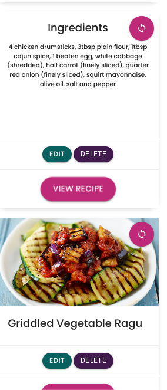

# M.O.C.A- My Own Cooking App

[M.O.C.A live site](https://moca-cook-app-970a7ec0db09.herokuapp.com/)

Welcome to **MOCA**! All the recipes you and your family love, all in one place! M.O.C.A (My Own Cooking App) is a simple ad easy to use app I made formyself to quicky access my favourite recipes without having to search through the myriad of books, online and pinterest pages to find their details. Recipes can be added simply and searched by category or by ingredient and viewed at the click of a button!

- This project was completed for the Milestone 3 project in Level 5 Web Application and Development. specifically the **Data Centric Development** module. The purpose for this milestone project is to "*Create a web application that allows users to store and easily access recipes*", using the **CRUD** operations of **C**reate, **R**ead, **U**pdate, and **D**elete for their recipes.

---

## Table of Contents
1. [**UX**](#ux)
    - [**User Stories**](#user-stories)
    - [**Design**](#design)
        - [**Color Scheme**](#color-scheme)
        - [**Icons**](#icons)
        - [**Typography**](#typography)
    - [**Wireframes**](#wireframes)
    - [**Database Schema**](#database-schema)

2. [**Features**](#features)
    - [**Existing Features**](#existing-features)
    - [**Future Features for scaling up of app**](#future-features-for-scaling-up-of-app)

3. [**Testing**](#testing)
    - [**Validators**](#validators)
    - [**Usability Testing**](#usability-testing)
    - [**Compatibility**](#compatibility)
    - [**Bugs and fixes**](#bugs-and-fixes)

4. [**Technologies Used**](#technologies-used)
    - [**Front-End Technologies**](#front-end-technologies)
    - [**Back-End Technologies**](#back-end-technologies)

5. [**Deployment**](#deployment)
    - [**Local Deployment**](#local-deployment)
    - [**Remote Deployment**](#remote-deployment)

6. [**Credits**](#credits)
    - [**Content**](#content)
    - [**Media**](#media)
    - [**Code**](#code)
    - [**Acknowledgements**](#acknowledgements)

---

## UX

### Rationale

This project is a personal endeavor to create a platform for managing recipes. I own lots of cookbooks but the rigmarole of checking through them every week is irritating. I am also on a personal quest to have a varied diet and cut down on my meat consumption. 

The goal is to provide a user-friendly interface where the user can easily add, view, and manage recipes while enjoying a clean, tidy and intuitive design.

### User Stories

"**_As a user, I would like to_** _____________________________"

:white_check_mark: *denotes items that have been successfully implemented*

- ✅ *view the site* from **any device** *(mobile, tablet, desktop)*.
- ✅ *view all recipes*.
- ✅ *search for recipes* by **category**.
- ✅ *search recipes* by **name** or **ingredients**.
- ✅ *view a single recipe* with **details** including **ingredients** and **instructions**.
- ✅ *add* new recipes with **name, description, ingredients, instructions, and image**.
- ✅ *edit* existing recipes and categories.
- ✅ *delete* recipes and categories.
- ✅ *upload an image* for each recipe.
- ✅ *view* recipes with a **clean layout** and **responsive design**.
- ✅ *ensure* at least one step is added when creating a recipe.

### Design

**Framework**: Utilizes **Bootstrap** and **Materialize** for responsive design and UI components.

#### Color Scheme**
Employs a warm and inviting color palette suitable for food-related content. 

## Color Usage

- **Main Color (`#0A605F`)**: This deep teal color is used for key interface elements like the header, footer, and navigation bar. It establishes a cohesive and balanced theme across the application, providing a rich yet neutral background.

- **Secondary Color (`#411B4E`)**: A dark plum-purple hue, this color is used for accents and backgrounds of certain components, adding a sophisticated contrast to the main color without overwhelming the interface.

- **Highlights Color (`#BE2A77`)**: This bold magenta-pink shade is used for interactive elements such as buttons, links, and alerts. It provides vibrant contrast and grabs user attention, making it clear which elements are clickable or important.

- **White (`#fff`)**: White is used extensively for text on dark backgrounds, as well as for sections where a clean, minimal look is desired. It ensures high readability and a crisp, modern design.

- **Black (`#000`)**: Black is primarily used for text on light backgrounds, creating sharp, easy-to-read contrast, as well as for the background of navigation elements.

This color palette is crafted to ensure a visually appealing and functional user interface, leveraging contrast and complementary shades for easy navigation and a pleasant user experience.

#### Icons: 
Uses icons from **FontAwesome** for visual enhancements.

#### Typography: 

- The typography for the Recipe App is designed to prioritize readability, clarity, and a modern aesthetic, enhancing the overall user experience.

1. **Font Family**: The primary font used is "Poppins", a sans-serif font, which provides a clean, contemporary look. For headings, the "Playfair Display" serif font is used, adding a touch of elegance and sophistication to the design. These choices ensure that the text is legible across all devices and browsers, while also giving the app a distinctive style.

2. **Font Weight**: A variety of font weights are used throughout the app to create visual hierarchy and emphasis. Bold weights are employed for headings (h1, h2, h3) to draw attention and make key sections stand out. Lighter weights are used for body text, maintaining a comfortable reading experience without overwhelming the user.

3. **Consistency**: Consistency in typography is maintained across the entire app to ensure a cohesive and unified design. The same font families, weights, and sizes are used throughout various sections, contributing to a harmonious and professional visual aesthetic. This consistency also reinforces the app's branding and enhances user navigation by providing a familiar visual structure.

By carefully selecting and applying these typography principles, the Recipe App not only looks visually appealing but also ensures that users can easily read and interact with the content.

## Wireframes
I used [Balsamiq Wireframes](https://balsamiq.com/wireframes/) to create wireframes before starting the project to help me plan the layout and flow of the project. 
When I was creating my website, the design plan was changed but only small placement changes.

 ### Homepage Wireframes

- [**Desktop**](./docs/wireframes/wf-homepage-desktop.png)
- [**Tablet**](./docs/wireframes/wf-homepage-tablet.png)
- [**Mobile**](./docs/wireframes/wf-homepage-mobile.png)

 ### Categories page Wireframes

- [**Desktop**](./docs/wireframes/wf-categories-desktop.png)
- [**Tablet**](./docs/wireframes/wf-categories-tablet.png)
- [**Mobile**](./docs/wireframes/wf-categories-mobile.png)

### Search Results page Wireframes

- [**Desktop**](./docs/wireframes/wf-search-results-desktop.png)
- [**Tablet**](./docs/wireframes/wf-search-results-tablet.png)
- [**Mobile**](./docs/wireframes/wf-search-results-mobile.png)

### View Recipe page Wireframes

- [**Desktop**](./docs/wireframes/wf-view-recipe-desktop.png)
- [**Tablet**](./docs/wireframes/wf-view-recipe-tablet.png)
- [**Mobile**](./docs/wireframes/wf-view-recipe-mobile.png)

### Add/edit Category page Wireframes

- [**All**](./docs/wireframes/wf-add-update-category-all.png)

### Add/edit Recipe page Wireframes

- [**All**](./docs/wireframes/wf-add-update-recipe-all.png)

---

## Database Schema
In this database, there are two main entities: Category and Recipe. These entities are related through a one-to-many relationship, where one category can have many recipes, but each recipe belongs to only one category.

### Entities

| **Category**                                                                 | **Recipe**                                                                 |
| ---------------------------------------------------------------------------  | -------------------------------------------------------------------------  |
| Represents a classification or group for recipes.                            | Represents a cooking recipe.                                                |
| Has attributes like `id`, `category_name`, and `image_url`.                   | Has attributes like `id`, `recipe_name`, `image_url`, `description`, `ingredients`, `instructions`, and `category_id`. |
| Can be associated with multiple recipes.                                     | Each recipe belongs to one category, which is enforced by the foreign key `category_id`. |

|  |  |
|:-----------------------------------------------------:|:-----------------------------------------------------:|
| Categories Table                                           | Recipe table                                                 | 
 

### Example and explanation of structure

  <h3>Category Table</h3>
  <table>
    <thead>
      <tr>
        <th>id</th>
        <th>category_name</th>
        <th>image_url</th>
      </tr>
    </thead>
    <tbody>
      <tr>
        <td>1</td>
        <td>Desserts</td>
        <td>/images/desserts.jpg</td>
      </tr>
      <tr>
        <td>2</td>
        <td>Main Course</td>
        <td>/images/maincourse.jpg</td>
      </tr>
    </tbody>
  </table>

  <h3>Recipe Table</h3>
  <table>
    <thead>
      <tr>
        <th>id</th>
        <th>recipe_name</th>
        <th>image_url</th>
        <th>description</th>
        <th>ingredients</th>
        <th>instructions</th>
        <th>category_id</th>
      </tr>
    </thead>
    <tbody>
      <tr>
        <td>1</td>
        <td>Chocolate Cake</td>
        <td>/images/cake.jpg</td>
        <td>Rich cake...</td>
        <td>Flour, eggs...</td>
        <td>Mix and bake</td>
        <td>1</td>
      </tr>
      <tr>
        <td>2</td>
        <td>Pasta Carbonara</td>
        <td>/images/pasta.jpg</td>
        <td>Italian dish...</td>
        <td>Pasta, eggs...</td>
        <td>Cook pasta...</td>
        <td>2</td>
      </tr>
      <tr>
        <td>3</td>
        <td>Apple Pie</td>
        <td>/images/pie.jpg</td>
        <td>Classic pie...</td>
        <td>Apples, flour...</td>
        <td>Bake at 350</td>
        <td>1</td>
      </tr>
    </tbody>
  </table>

### Relationship:

#### One-to-Many Relationship (Category to Recipe):

- **One Category can have many Recipes**: This is implemented by the `recipes` relationship in the `Category` model. It uses the `db.relationship()` method to define the relationship with the `Recipe` model.

- **One Recipe belongs to one Category**: This is enforced in the `Recipe` model with the `category_id` field, which is a foreign key that references the `id` field of the `Category` table using `db.ForeignKey('category.id')`.

#### Example:
For example, both "Chocolate Cake" and "Apple Pie" belong to the "Desserts" category (`category_id = 1`), while "Pasta Carbonara" belongs to the "Main Course" category (`category_id = 2`).

---

## Features

### Existing Features

- **Recipe Management**: Users can add, edit, and delete recipes with detailed ingredients, steps, and images.
- **Recipe Management- Searching**: for recipes by name, ingredients, or category, making it easier to find suitable options based on available ingredients or dietary preferences.
- **Recipe Details**: Displays ingredients and instructions in a well-organized format.
- **Image Upload**: Users can upload images for recipes.
- **Responsive Design**: The app is optimized for viewing on multiple devices, ensuring accessibility on desktop, tablet, and mobile platforms.
- **Categorization**: Recipes are organized into categories, making it easier for users to filter recipes by type (e.g., breakfast, lunch, dinner, vegetarian, etc.).

### Value Provided to Users

- **Time Saving**: No more flipping through cookbooks or hunting for recipe cards. The app organizes all recipes in one place with an intuitive search function.
- **Dietary Flexibility**: Users can track and manage different types of recipes, helping them meet dietary goals, such as reducing meat consumption or maintaining variety in their meals.
- **Convenience**: The app can be accessed on any device, making it easy to follow a recipe in the kitchen from a phone or tablet.
- **Customisation**: Users have the ability to upload personal recipes, edit them, and categorize them, giving them full control over their digital cookbook.

### Future Features for scaling up of app

- **Advanced Filtering**: Implement more detailed filters for dietary needs and preparation time.
- **Advanced recipe input**: eg, allowing more indepth and precise ingredients adding, standardizing quantity and weight amounts and conversion.
- **Recipe Recommendations**: Suggest recipes based on user activity and preferences.
- **Meal Planning**: Add functionality for meal planning and grocery list generation.
- **User Profiles**: Enhance profiles with user-specific recipes and saved favorites.
- **Printing and Sharing**: Options to print recipes and share them via social media.
- **User Authentication**: Basic functionality for managing recipes.
- **Defensive Programming**: Extra stepps added prior to deletion for recipe security.

--- 

## Testing
### Accessibility Testing
- **Accessibility Testing**: Ensures the site is accessible to all users, including those with disabilities.

| Test Case ID | Test Description                                                                                             | Expected Result                                                                                       
|--------------|-------------------------------------------------------------------------------------------------------------|-------------------------------------------------------------------------------------------------------|
| AT-01        | Verify the website meets accessibility standards (e.g., chrome DevTools, lighthouse)                                            | Website meets accessibility standards, ensuring it is usable by people with disabilities Accessibility score in the green (90-100)              |

### Desktop Lighthouse Test Results

| Page | Home | Categories | Add Recipe | Edit Recipe | Add Category | Edit Category | View Search Results | View Recipe |
|----------|----------|----------|----------|----------|----------|----------|----------|----------|
| Scores    | Acessibility- 100   Best Practices- 96   | Acessibility- 100   Best Practices- 96   | Acessibility- 93   Best Practices- 100   | Acessibility- 93   Best Practices- 96   | Acessibility- 93   Best Practices- 96   | Acessibility- 100   Best Practices- 96   | Acessibility- 100   Best Practices- 96   | Acessibility- 100   Best Practices- 96   |
| Pass/fail   | Pass   | Pass  | Pass  | Pass  | Pass  | Pass  | Pass  | Pass |
| Evidence    | [Image Results](./docs/testing/lighthouse-testing/lighthouse-desktop-homepage.png) | [Image Results](./docs/testing/lighthouse-testing/lighthouse-desktop-categories.png)  | [Image Results](./docs/testing/lighthouse-testing/lighthouse-desktop-add-recipe.png)  | [Image Results](./docs/testing/lighthouse-testing/lighthouse-desktop-edit-recipe.png)  | [Image Results](./docs/testing/lighthouse-testing/lighthouse-desktop-add-category.png)  | [Image Results](./docs/testing/lighthouse-testing/lighthouse-desktop-edit-category.png)  | [Image Results](./docs/testing/lighthouse-testing/lighthouse-desktop-search-results.png)  | [Image Results](./docs/testing/lighthouse-testing/lighthouse-desktop-view-recipe.png) |

### Mobile Lighthouse Test Results

| Page | Home| Categorieies | Add Recipe | Edit Recipe | Add Category | Edit Category | View Search Results | View Recipe |
|----------|----------|----------|----------|----------|----------|----------|----------|----------|
| Scores    | Accessibility- 100   Best Pracices- 96   | Data Accessibility- 100   Best Pracices- 96   | Accessibility- 93   Best Pracices- 100  | Acessibility- 93   Best Practices- 96   | Acessibility- 93   Best Practices- 96   | Acessibility- 100   Best Practices- 96   | Acessibility- 100   Best Practices- 96   | Acessibility- 100   Best Practices- 96   | Acessibility- 100   Best Practices- 96
| Pass/fail    | Pass   | Pass  | Pass  | Pass  | Pass  | Pass  | Pass  | Pass  |
| Evidence    | [Image Results](./docs/testing/lighthouse-testing/lighthouse-mobile-homepage.png)  | [Image Results](./docs/testing/lighthouse-testing/lighthouse-mobile-categories.png)  | [Image Results](./docs/testing/lighthouse-testing/lighthouse-mobile-add-recipe.png)  | [Image Results](./docs/testing/lighthouse-testing/lighthouse-mobile-edit-recipe.png)  | [Image Results](./docs/testing/lighthouse-testing/lighthouse-mobile-add-category.png)  | [Image Results](./docs/testing/lighthouse-testing/lighthouse-mobile-edit-category.png)  | [Image Results](./docs/testing/lighthouse-testing/lighthouse-mobile-search-results.png)  | [Image Results](./docs/testing/lighthouse-testing/lighthouse-mobile-view-recipe.png)  |

### Compatibility Testing
- **Compatibility Testing**: Ensures the site works across different browsers and devices.

| Test Case ID | Test Description                                                                               | Expected Result                                                                                          | Status | Comments          |
|--------------|------------------------------------------------------------------------------------------------|----------------------------------------------------------------------------------------------------------|--------|-------------------|
| CT-01        | Verify the website is responsive and works on various devices (desktop, tablet, mobile)         | Website is responsive and works on various devices                                                        | Pass   |  |

**In Detail:**

| Device type/  Page Name(s)         | Mobile                        |                | Tablet                          |                | Desktop                        |                |
|----------------------|-------------------------------|----------------|---------------------------------|----------------|--------------------------------|----------------|
|                      | iPhone SE (375x667)           | Pixel 7 (412x915) | iPad Mini (768x1024)             | Surface Duo (540x720) | Nest Hub (1024x600)           | Nest Hub Max (1280x800) |
| Pass or Fail             |                      ✅                 |         ✅       |                    ✅             |           ✅     |              ✅                  |         ✅       |

### Validators
- **Validator Testing**: Ensures that the website's code adheres to established standards and best practices, which helps improve functionality, accessibility, and cross-browser compatibility.

- **HTML**: Validated using [W3C HTML Validator](https://validator.w3.org/). 

| Test Case ID | Test Description                                                                                             | Expected Result                                                                                       |
|--------------|-------------------------------------------------------------------------------------------------------------|-------------------------------------------------------------------------------------------------------|
| VT-01        | HTML: code adheres to standards and best practices when run through the validator                            | Code passes through the validator with no errors                                                      |

| Page                | base.html                                                                                 | Categories                                                                                 | Add Recipe                                                                                 | Edit Recipe                                                                                 | Add Category                                                                                 | Edit Category                                                                                 | View Search Results                                                                          | View Recipe                                                                                  | recipes.html                                                                                 |
|---------------------|--------------------------------------------------------------------------------------------|--------------------------------------------------------------------------------------------|--------------------------------------------------------------------------------------------|--------------------------------------------------------------------------------------------|--------------------------------------------------------------------------------------------|--------------------------------------------------------------------------------------------|--------------------------------------------------------------------------------------------|--------------------------------------------------------------------------------------------|--------------------------------------------------------------------------------------------|
| Pass/fail           | ❌ See comments                                                                                       | ✅                                                                                       | ✅                                                                                       | ✅                                                                                        | ✅                                                                                       | ✅                                                                                       | ✅                                                                                       | ✅                                                                                       | ✅                                                                                       |
| Evidence            |    [Image Results](./docs/testing/validator-testing/w3c-jinja-errors.png)        | [Image Results](./docs/testing/validator-testing/w3c-categories-html.png)         | [Image Results](./docs/testing/validator-testing/w3c-add-recipe-html.png)        | [Image Results](./docs/testing/validator-testing/w3c-edit-recipe-html.png)        | [Image Results](./docs/testing/validator-testing/w3c-add-category-html.png)       | [Image Results](./docs/testing/validator-testing/w3c-edit-category-html.png)       | [Image Results](./docs/testing/validator-testing/w3c-view-search-results-html.png)        | [Image Results](./docs/testing/validator-testing/w3c-view-recipe-html.png)       | [Image Results](./docs/testing/validator-testing/w3c-recipe-html.png)            |

*-Comments:* When first undertaking the validation of the HTML using the W3C validator, I kept getting errors to do with the jinja templating ([Image](./docs/testing/validator-testing/w3c-jinja-errors.png)). Research on chatGPT gave this option, *'Since Jinja syntax is meant to be rendered server-side before the final HTML is served to the user, it’s important to validate the final HTML output that the user sees in their browser, not the raw template code that contains Jinja.'* This meant that instead of copying and pasting my code from codepen, I cose to "View Page Source" for each page, giving me the full page markup. I then copied and pasted this into the validator in order to validate my html pages.

- **CSS**: Validated using [W3C CSS Validator](https://jigsaw.w3.org/css-validator/).

| Test Case ID | Test Description                                                                                             | Expected Result                                                                                       | Pass/Fail | Comments                                                                                         |
|--------------|-------------------------------------------------------------------------------------------------------------|-------------------------------------------------------------------------------------------------------|-----------|--------------------------------------------------------------------------------------------------|
| VT-02        | CSS: Code adheres to standards and best practices when run through the validator                         | Code passes through the validator with no errors                                                      | ✅        | [W3C CSS Validator results](https://jigsaw.w3.org/css-validator/#validate_by_input) -  |

- **JavaScript**: Validated using [JS Hint Validator](https://jshint.com/).

| Test Case ID | Test Description                                                                                             | Expected Result                                                                                       | Pass/Fail | Comments                                                                                                                                                                                                                   |
|--------------|-------------------------------------------------------------------------------------------------------------|-------------------------------------------------------------------------------------------------------|-----------|----------------------------------------------------------------------------------------------------------------------------------------------------------------------------------------------------------------------------|
| VT-03        | JavaScript: code adheres to standards and best practices when run through the JSHint validator              | Code passes through the validator with no errors                                                      | ✅      | [JSHint Validator script.js](https://jshint.com/) - |

*-Comments:* When first undertaking the validation of the JavaScript using the jsHint validator, I kept getting errors to do *'M bring an undefined variable'*. Within the context of the MOCA app, M refers to the global object provided by the Materialize CSS framework. It is used in the initialization of components *(M.Sidenav.init(sidenav) and M.FormSelect.init(selects))* and the updating of components *(M.updateTextFields())*. JSHint needs to be informed about global variables that are defined elsewhere, especially if they are part of a library or framework like Materialize. As such, I added the comment *'global M'* at the top of my javaScript file which declares M as a global variable.

- **Python**: Validated using [Pep8](https://pep8ci.herokuapp.com/). 

| Test Case ID | Test Description                                                                                             | Expected Result                                                                                       |
|--------------|-------------------------------------------------------------------------------------------------------------|-------------------------------------------------------------------------------------------------------|
| VT-04        | Python files: code adheres to standards and best practices when run through the validator                    | Code passes through the validator with no errors                                                      |

| Page                | run.py                                                                                               | env.py                                                                                               | routes.py                                                                                              | models.py                                                                                              | __init__.py                                                                                           |
|---------------------|-----------------------------------------------------------------------------------------------------|------------------------------------------------------------------------------------------------------|------------------------------------------------------------------------------------------------------|------------------------------------------------------------------------------------------------------|------------------------------------------------------------------------------------------------------|
| Pass/fail           | ✅                                                                                                   | ✅                                                                                                    | ✅                                                                                       | ✅                                                                                                    | ✅                                                                                                    |
| Evidence            | [Image Results](./docs/testing/validator-testing/pep8-run-py.png)                                       | [Image Results](./docs/testing/validator-testing/pep8-env-py.png)                                        | [Image Results](./docs/testing/validator-testing/pep8-routes-py.png)                              | [Image Results](./docs/testing/validator-testing/pep8-models-py.png)                                     | [Image Results](./docs/testing/validator-testing/pep8-init-py.png)                                       |

### Usability Testing
- **Usability Testing**: Focuses on the user experience, ensuring the site is easy to understand and navigate, and that guides are effective.

| Test Case ID | Test Description                                                                                             | Expected Result                                                                                       | Pass/Fail | Comments                       |
|--------------|-------------------------------------------------------------------------------------------------------------|-------------------------------------------------------------------------------------------------------|-----------|-------------------------------|
| UT-01        | Verify the homepage clearly communicates the purpose of the site to first-time visitors                      | First-time visitors can easily understand the site's purpose.                                          | ✅         | Purpose and intent evident. It has a title and description section which explains the site in the first instance. |

**Evidence:**

              

| Test Case ID | Test Description                                                                                             | Expected Result                                                                                       | Pass/Fail | Comments                       |
|--------------|-------------------------------------------------------------------------------------------------------------|-------------------------------------------------------------------------------------------------------|-----------|-------------------------------|
| UT-02        | Verify the user interface is intuitive and easy to navigate                      | Users can easily navigate the site without confusion                                          | ✅         | Site uses commonly recognised tools and layout features which will be known and familiar to users, for example, search bars, forms and buttons. Site is well spaced, with only key content used in order to remain uncluttered. Buttons linking to other pages and information allow for more info to be given without cluttering up the interface and can be accessed only as and when the user feels they may need it. Similar pages use the same elements and styling in order to reduce cognitive load on users and achieve cohesion across the site |

**Evidence:**

*Site uses commonly recognised tools and features familiar to users*

|  |  |  |  |
|:-----------------------------------------------------:|:-----------------------------------------------------:|:-----------------------------------------------------:|:-----------------------------------------------------:|
| Search bar                                            | Forms                                                 | Buttons                                               | Dropdown menu                                         |
 

*Site is well spaced, with only key content used in order to remain uncluttered. Buttons linking to other pages and information allow for more info to be given without cluttering up the interface and can be accessed only as and when the user feels they may need it.*

|  | **Comment:** The navbar has only 3 options despite the fact that the site has 8 pages. This is because this is the minimum number of direct links needed for the site to function. The flow of information is cleaner and uncluttered through access via specific buttons on these 3 pages, creating a more logical workflow. (See below)  |
|:----------------------------------------------------:|:------------------------------------------------------------------:|

| **Comment:** The only way to access a recipe's full information is through the 'View Recipe' button which directs users to a page which displays the whole recipe in an attractive card format.   |  |
|:----------------------------------------------------:|:------------------------------------------------------------------:|

|  | **Comment:** Users have the option to 'Quick View' the ingredients of a recipe through the circular loop button. This replaces the image with a list of ingredients for the recipe. This allowsusers to quickly access more information without cluttering up the interface.  |
|:----------------------------------------------------:|:------------------------------------------------------------------:|
 
- **Comment:** The only way to access and view search results is either through the search bar or through the 'View All' buttons on the category cards

|  |  |  | 
|:-----------------------------------------------------:|:-----------------------------------------------------:|:-----------------------------------------------------:|
| Search bar                                            | 'View All' of a category                                                 | Search Results                                               |
 

*Similar pages use the same elements and styling in order to reduce cognitive load on users and achieve cohesion across the site*

- **Comment:** All pages follow the same format with regards to navbars, title and heading elements and the colour and sizing of these elements. In adition to this, all multi-card pages (home/recipes.html, categories.html and search_results.html), all follow the same template. They are responsive in the same way and their card elements folow the same format.

|  |  |  | 
|:-----------------------------------------------------:|:-----------------------------------------------------:|:-----------------------------------------------------:|
| home/recipes page                                           | Categories page                                                 | Search Results page                                              |

- **Comment:** All pages follow the same format with regards to navbars, title and heading elements and the colour and sizing of these elements. In adition to this, all form based pages (add/edit recipe, add/edit category), all follow the same template. Their card elements folow the same format.

|  |  |  |  |
|:-----------------------------------------------------:|:-----------------------------------------------------:|:-----------------------------------------------------:|:-----------------------------------------------------:|
| Add Recipe                                            | Edit Recipe                                                 | Add Category                                               | Edit Category                                         |
 

| Test Case ID | Test Description                                                                                             | Expected Result                                                                                       | Pass/Fail | Comments                       |
|--------------|-------------------------------------------------------------------------------------------------------------|-------------------------------------------------------------------------------------------------------|-----------|-------------------------------|
| UT-03        | Ensure C.R.U.D functionality across the site                      | Users are able to Create, Read Update and Delete records within the database                                          | ✅         | Users can create new Categories and Recipe elements. Users are able to view saved Categories and Recipes through the sites pages. Users can Update/ edit entries in the database and site. Users can Delete Categories and Recipes from the site and database |

**Evidence:**

*Users are able to Create Categories and Recipe elements and save their data to the database*

- **Comment:** Users can create Categories for their differing recipes and store them with a category id.

|  |  |  | 
|:-----------------------------------------------------:|:-----------------------------------------------------:|:-----------------------------------------------------:|
| Categories- add Category                                            | Fill form with details (Name and image)                                                 | Data stored in backend and shown on frontend with a flash message to confirm                                               |
 

- **Comment:** Users can create Recipe and store their details (name, description, image, ingredients, instructions and category) to the database.

|  |  |  | 
|:-----------------------------------------------------:|:-----------------------------------------------------:|:-----------------------------------------------------:|
| Navbar/ side nav- Add Recipe                                            | Fill form with details (name, description, image, ingredients, instructions and category)                                                 | Data stored in backend and shown on front end with a flash message to confirm                                               |
 

*Users are able to Read/ view Categories and Recipe data which is saved to the database (backend) on the interface(frontend)*

- **Comment:** Users can Read/ view the Categories which have currently been stored in the Categories table of the database.
|  |
 

- **Comment:** Users can Read/ view the Recipes stored in the database. Users have a choice of differentways to view recipe data:

|  | **Comment:** on the homepage, users can view all the recipes saved to the database  |
|:----------------------------------------------------:|:------------------------------------------------------------------:|

| **Comment:** Users are able to retrieve the ingredients of a particular recipe by using the round quick look bbutton to the top right of the recipe card to replaece the image with a simple list of ingredients  |  |
|:----------------------------------------------------:|:------------------------------------------------------------------:|

  | **Comment:** Users can Read/ view the whole recipe (all fields) with the 'View Recipe' button at the bottom of the card. This directs the user to a page which shows the recipe in its entirety  |
|:----------------------------------------------------:|:------------------------------------------------------------------:|

 **Comment:** Users can Read/ view all of the recipes belonging to a certain category by choosing the catagory, pressing the view all button which directs them to a search results page.

|  |  |
|:-----------------------------------------------------:|:-----------------------------------------------------:|
| Categories- View all                                            | Search results                                                 | 
 

**Comment:** Users can Read/ view all of the recipes which have a certain ingredient of word in their title by using the searchbar which will direct to a searchresults page after querying the database. 

|  |  |
|:-----------------------------------------------------:|:-----------------------------------------------------:|
| Searchbar                                           | Search results                                                 | 
 

*Users are able to Update/edit Categories and Recipe data which is saved to the database (backend) and viewed on the interface(frontend)*

- **Comment:** Users can update/edit Category data and store their details (name, image, ) to the database.

|  |  |  | 
|:-----------------------------------------------------:|:-----------------------------------------------------:|:-----------------------------------------------------:|
| Use Edit button to access form to update details                                           | Fill form with new details                                                  | Data stored in backend and shown on front end with a flash message to confirm                                               |
 

- **Comment:** Users can update/edit Recipe data and store their details (name, image, description, ingredients, instructions, category) to the database.

|  |  |  | 
|:-----------------------------------------------------:|:-----------------------------------------------------:|:-----------------------------------------------------:|
| Use Edit button to access form to update details                                           | Fill form with new details                                                  | Data stored in backend and shown on front end with a flash message to confirm                                               |
 

|  |  |
|:-----------------------------------------------------:|:-----------------------------------------------------:|
| Updated 'Quick view' ingredients                                           | Updated whole recipe card                                                 | 
 

*Users are able to Delete Categories and Recipe data which is saved to the database (backend) and viewed on the interface(frontend)*

- **Comment:** Users can Delete Recipe data which will be deleted from the database.

|  |  |
|:-----------------------------------------------------:|:-----------------------------------------------------:|
| Delete recipe                                           | Confirmation of recipe deletion through flash message                                                 | 
 

- **Comment:** Users can Delete Category data which will be deleted from the database along with any recipes associated within that category the database. For example:

| **Comment:** Within the 'Test Category' category, there are currently two recipes (Test Editing 1, A test Recipe)  |  |
|:----------------------------------------------------:|:------------------------------------------------------------------:|

- **Comment:** On deletion of a category, both the category and recipes within that category will be deleted from the database and on the front end..

|  |  |
|:-----------------------------------------------------:|:-----------------------------------------------------:|
| Delete Category confirmation through flash message                                           | Visual confirmation of all recipes associated with the test category                                                 | 
 

| Test Case ID | Test Description                                                                                             | Expected Result                                                                                       | Pass/Fail | Comments                       |
|--------------|-------------------------------------------------------------------------------------------------------------|-------------------------------------------------------------------------------------------------------|-----------|-------------------------------|
| UT-04        | Give feedback to user with regards to data processes                      | Whilst Creating, Updating and Deleting data from the database, the user is given messages as to the completion of that task                                          | ✅         | Users are shown appropriate flash messages when they Create, Update or Delete in/from the database |

**Evidence:**

- **Comment:** Users see a flash message when successfully adding, updating or deleting category data from the database

|  |  |  | 
|:-----------------------------------------------------:|:-----------------------------------------------------:|:-----------------------------------------------------:|
| add recipe confirmation                                           | Update recipe confirmation                                                  | Deleted recipe confirmation                                               |
 

|  |  |  | 
|:-----------------------------------------------------:|:-----------------------------------------------------:|:-----------------------------------------------------:|
| add category confirmation                                           | Update category confirmation                                                  | Deleted category confirmation                                               |
 

| **Comment:** Other message example- Error if a category already exists  |  |
|:----------------------------------------------------:|:------------------------------------------------------------------:|

### Compatibility

- **Browsers**: Tested across major browsers including Chrome, Firefox, Safari, and Edge.
- **Devices**: Ensured responsiveness on mobile devices, tablets, and desktops.

---

#### Bugs and fixes

#### Issue 1: 
 When I try to connect the database with python : db.create_all(), or psql command not found or running the run.py am met with errors.

- **Explanation**: Was unable to create the database and access it due to versioning issues, dependency issues and outdated commands.

#### Fix:
Create and run a requirements.txt file:

|  | **Comment:** Open a text editor and add each package needed for the correct running of the site.   Then install with the command `pip install -r requirements.txt`. This command installs the exact versions listed in the `requirements.txt`, making the setup reproducible and minimizing potential conflicts. |
|:----------------------------------------------------:|:--------------------------------------------------------------------------------------------------------------------------------------------------------------------------------------------------------:|

- **Explanation**: Creating a requirements.txt file is an essential part of managing Python projects, especially when using packages and dependencies. A requirements.txt file helps manage and keep track of the packages required for the correct running of projects, ensuring that all packages and dependencies can run together with no error or conflicts.
 

#### Issue 2: 
On attempting to run the app using `python3 run.py`, gettintg the following warning:

`/workspace/.pip-modules/lib/python3.12/site-packages/flask_sqlalchemy/__init__.py:872: FSADeprecationWarning: SQLALCHEMY_TRACK_MODIFICATIONS adds significant overhead and will be disabled by default in the future.  Set it to True or False to suppress this warning.
  warnings.warn(FSADeprecationWarning(`

- **Explanation**: warning is related to the SQLALCHEMY_TRACK_MODIFICATIONS configuration option in Flask-SQLAlchemy. This option tracks modifications of objects and emits signal. In future versions of Flask-SQLAlchemy, this option will be disabled by default, which is why the warning is popping up.

#### Fix:
within the `__init__.py` file ammend the `app.config["SQLALCHEMY_TRACK_MODIFICATIONS"]` to false.

`app.config["SQLALCHEMY_TRACK_MODIFICATIONS"] = False  # Add this line`

- **Explanation**: disables the event system that tracks modifications of objects and signals. The warning should disappear when the app. This change doesn't affect the functionality of the application but will remove the unnecessary warning message.
 

#### Issue 3: 
When building the recipe cards, I wanted to use the materialize card functionality to 'turn the card over'so to speak. In this case, on pressing a button, the card turns and shows a list of ingredients for the recipe. On checking this, the action would show the ingredients but then get stuck on the list and not reverting back to the front of the card image.

|  | **Explanation:** In the first iteration, the card adds and removes the `active` class, however, this only worked for 1 iteration and then the page needed to be reloaded to get the card back to it's original state. |
|:----------------------------------------------------:|:--------------------------------------------------------------------------------------------------------------------------------------------------------------------------------------------------------:|

#### Fix:
use a javaScript `toggle method`:

- **Explanation:** Instead of using classList.add('active') to show the card reveal and classList.remove('active') to hide it, we use classList.toggle('active'). This method checks if the class is present: If the active class is present, toggle will remove it, hiding the card reveal. If the active class is not present, toggle will add it, showing the card reveal. Result: Each time you click the reveal button (floating icon), the card will alternate between showing the back (ingredients) and the front (image). The button inside the card reveal will also toggle the view back to the front side when clicked. |
 

#### Issue 4: 
On attempting to add a recipe to the database:
`sqlalchemy.exc.DataError: (psycopg2.errors.StringDataRightTruncation) value too long for type character varying(200)`

- **Explanation:** On attempting to add more detailed recipe data beyond simple test recipe and place holders resulting in the above error. This error indicates that the string inputted in the form is longer than the maximum allowed length for one of the columns in your recipe table.

#### Fix:
increase the length or 'type' of affected columns.:

- **Explanation:** I increased the allowed length of the title and description fields to 500 characters, and ensured other text fields requiring lengthier data set to 'text' as that has no restrictions on length.
 

#### Issue 5: 
On attempting to add a recipe to the database:
`sqlalchemy.exc.DataError: (psycopg2.errors.StringDataRightTruncation) value too long for type character varying(200)`

- **Explanation:** On attempting to add more detailed recipe data beyond simple test recipe and place holders resulting in the above error. This error indicates that the string inputted in the form is longer than the maximum allowed length for one of the columns in your recipe table.

#### Fix:
increase the length or 'type' of affected columns.:

- **Explanation:** I increased the allowed length of the title and description fields to 500 characters, and ensured other text fields requiring lengthier data set to 'text' as that has no restrictions on length.
 

#### Issue 6: 
Form field text input just cutting out and not allowing any more typing.

**Explanation:** On attempting to add a new recipe using the add recipe form, the input for 'recipe name' would just cut out and not allow anymore characters. I checked the database/ models.py file and checked the recipe_name field but I was well within the character length.

#### Fix:
Increase the lenght allowed in the form itself in `add_category.html'

**Explanation:** Although the models.py file had plenty of characters, the html of the form input was limited to 25. Increasing this:
`<input id="recipe_name" name="recipe_name" minlength="3" maxlength="100" type="text" class="validate" required>` fixed the issue.
 

#### Issue 7: 
On attempting to amend database in models.py and migrate the changes:
`flask db migrate -m "Added image_file column to Recipe model"
flask db upgrade
Error: Could not locate a Flask application. Use the 'flask --app' option, 'FLASK_APP' environment variable, or a 'wsgi.py' or 'app.py' file in the current directory.`

**Explanation:** Flask couldn't find the application because the environment isn't correctly set up. Also 'Flask-migrate was not installed so commands like 
`flask db migrate -m "Added image_file column to Recipe model"
flask db upgrade` 
would not work.

#### Fix:
Install Flask-Migrate and then migrate changes.

- 1. Install Flask-Migrate. `<pip install flask-migrate`.
- 2. Ensure flask-migrate is et up in run.py. `from flask_migrate import Migrate` and `migrate = Migrate(app, db)`.
- 3. Make sure flask_migrate is imported into your app- in 'moca/__init__.py add:
- - from flask_migrate import Migrate
- - migrate = Migrate(app, db)
- - (Import your routes and models)
- - import moca.routes
- - import moca.models
- 4. Initialize migrations: `flask db init`.
- 5. Create Migration Script: `flask db migrate -m "Increase line length"`.
- 6. Apply the migration: `flask db migrate -m "flask db upgrade`.

**Explanation:** The above steps install flask-migrate and allow changes to be made to the database.
 

#### Issue 8: 
Lower than expected lighthouse accessibility scores.

**Explanation:** Poor accessibility scores due to a lack of 'alt text' for images. The problem being that as images are uploaded by the user, it is not as straight forward as simply hard coding it straight into the html. An automatic solution was required to improve accessibility without adding extra work to the user.

#### Fix:
Use 'fallback text' or use information from the name field to populate the alt text using jinja.

``

**Explanation:** Using the jinja syntax in the alt text allows us to retrieve the recipe name from the database and inject it into the alt text ensuring that there is appropriate alt text for accessibility. This can be checked and seen when inspecting in the browser (see above). This fix allowed me to make user-generated content accessible. This approach ensures that even though images are uploaded by users, they still meet accessibility standards.
 

#### Issue 9: 
Accessibility- side nav trigger *'Link text (and alternate text for images, when used as links) that is discernible, unique, and focusable improves the navigation experience for screen reader users.'*

**Explanation:** a.sidenav-trigger link needs better, more descriptive text for screen readers to understand its purpose. The current icon <i class="fas fa-bars"></i> is not accessible because screen readers cannot interpret icons without associated text.

#### Fix:
provide a visually hidden text inside the anchor tag that describes the link's purpose. 

Open mobile navigation

|  | 
|:-----------------------------------------------------:|
| base.html- add the span with the required text and give the span the class of sr-only                                         

**Explanation:** Screen readers will pick up this hidden text, while it remains invisible to sighted users.
 

---

## Technologies Used

* [Am I Responsive?](http://ami.responsivedesign.is/) - To show the website image on a range of devices.
* [Balsamiq](https://balsamiq.com/) - Used to create wireframes.
* [Git](https://git-scm.com/) - For version control to track changes in the source code during development.

* [GitHub](https://github.com/) - Hosts the repository that can be deployed to GitHub Pages, providing backup and version control.
* **Lucid Chart** [Lucid chart](https://www.lucidchart.com/) - Employed for creating clear and ERDs (Entity-Relationship Diagrams) to visualize data relationships in the application.
* **Gitpod** The IDE used to develop the project.
* **Google Fonts** For typography accross the site..

### Front-End Technologies

- **HTML5**: Markup language for structuring the web content.
- **CSS3**: Styling the visual presentation.
- **JavaScript**: Adding interactivity and dynamic content.
- **Bootstrap**: Framework for responsive design.
- **Materialize**: UI components and design enhancements.
- **FontAwesome**: Icons for visual representation.

### Back-End Technologies

- **Python**: Programming language used for server-side logic.
- **Flask**: Web framework for building the application.
- **Flask-Migrate**:[Flask-Migrate](https://flask-migrate.readthedocs.io/en/latest/) - An extension that handles SQLAlchemy database migrations for Flask applications using Alembic.
- **SQLAlchemy**: ORM for database management.
- **SQLite**: Database system used for data storage.
- [PostgreSQL](https://www.postgresql.org/) - An open-source relational database system used to manage the application’s data effectively.
- **Heroku**:[Heroku](https://www.heroku.com/) - A cloud platform as a service supporting several programming languages, used to deploy the web application.
- **Jinja** [Jinja](https://jinja.palletsprojects.com/) - A modern and designer-friendly templating language for Python, modeled after Django’s templates. Used to dynamically render HTML templates.

---

## Deployment

### Local Deployment
Please note - in order to run this project locally on your own system, you will need the following installed:
- [Python3](https://www.python.org/downloads) to run the application.
- [PIP](https://pip.pypa.io/en/stable/installing) to install all app requirements.
- Any IDE such as [Microsoft Visual Studio Code](https://code.visualstudio.com). For this project I used the [Gitpod IDE](https://www.gitpod.io/) IDE associated with the Code Institute and the [Code Institute Template](https://github.com/Code-Institute-Org/ci-full-template).

#### Initial Project Set-Up

1. To start with I opened the [Code Institute Template](https://github.com/Code-Institute-Org/ci-full-template).
2. I then clicked the green `Use thiss template` button and pressed `Create a new repository`.
3. I then gave my repository a name, in this case `MOCA-app` and pressed the green `Create reopsitory` button.
4. Your project now has is own github repository.
5. I then pressed the `Open` button in the top right of the repository. This linked the repository to my gitpod account allowing me to work in my chosen IDE.

#### Create the Flask Application

1. Installed the two required Python Packages using the command `pip3 install 'Flask-SQLAlchemy<3' psycopg2 sqlalchemy==1.4.46`
2. Created an `env.py` file to store sensitive information.
3. Opened the `gitignore` file for folders and files which should be ignored by Github- in this case, the `env.py` file.
4. within the `env.py` file I imported operating system to set up environment variables for `IP`, `PORT`, `SECRET_KEY`, `DEBUG`, `DEVELOPMENT` and `DB_URL`.

- - -  A note on `DEBUG`. This was initially set to True but was set to 'False' just prior to submission of the project.

5. Create the project's Python Package by creating a new folder, `moca`.
6. Within the `moca` folder, create an `__init__.py` file which will initialize the application as a package allowing us to use imports.

7. Created a `routes.py` file to define and handle URL routes (endpoints) and functions to handle the routes.

8. Created a `run.py` file at the root level of the application to run the application.

9. Created a `requirements.txt` file, at the root level, ensuring that all packages and dependencies are set up to the correct versions without creating errors and conflicts. It also ensures that the application can be set up in any environment with the same dependencies, making it easier to share and deploy the project. 

- - - This can either be done manually with the below working dependencies

and then installed with the command `pip install -r requirements.txt`

#### Create the Database
The database will store all of the data we need for the 'MOCA' application. For this application I have used Postgres.

1. Created a `models.py` file to define the database. Import db from the moca package `from moca import db` at the top of the file.

2. Created the tables for the database. This project has 2 tables, 'Categories' and 'Recipes'.

|  |  |
|:-----------------------------------------------------:|:-----------------------------------------------------:|
| Categories Table                                           | Recipe table                                                 | 

3. Ensured classes are imported   in order to generate database: `from moca, models import Category, Recipe'` at top on `routes.py` file.

4. login to the postgres CLI
- - in terminal type `set_pg` and then `psql` and `enter`. 
5. To create the database type `CREATE DATABASE moca;` That should create the database.
6. To migrate the models into the database:
- - access python interpreter `python3`.
- - import the 'db' variable- `from moca import db`
- - `db.create_all()`
- - The postgres database should be populated with the two tables 'Categories' and 'Recipes'.

### Forking the Repository

By forking the GitHub Repository we are able to make a copy of the original repository on our GitHub account to view and/or make changes which do not affect the original repository by using the following steps...

1. Log in to GitHub and locate the GitHub Repository [MOCA-app](https://github.com/AlexandraEL9/MOCA-app).
2. At the top of the Repository (not top of page) just below the "Settings" Button on the menu, locate the "Fork" Button.
3. Rename if needed and press `Create Fork`.
3. You should now have a copy of the original repository in your GitHub account.

### Cloning the Repository
To make a Local Clone:

1. Login to Github and locate the GitHub Repository [MOCA-app](https://github.com/AlexandraEL9/MOCA-app).
2. Click the green `Code` button.
3. Copy the HTTPS link.
4. Open your IDE workspace.
Many of the files will be in place but you will need to add some to run the project locally:
5. Create a `gitignore` file with the command `touch .gitignore`.
6. Create `env.py` file.
7. `pip install -r requirements.txt` to set up the correct dependencies.
8. Re-create the database in the `models.py` file with the commands:
- - in terminal type `set_pg` and then `psql` and `enter`. 
- - To create the database type `CREATE DATABASE moca;` That should create the database.
- - To migrate the models into the database:
- - access python interpreter `python3`.
- - import the 'db' variable- `from moca import db`
- - `db.create_all()`
- - The postgres database should be populated with the two tables 'Categories' and 'Recipes'.

**Success** You now have your own local clone of the MOCA app!

### Remote Deployment

- **Hosting**: The project is hosted on [Heroku](https://heroku.com).
- **Deployment Steps**: Follow the steps for deployment: MOCA is deployed using Heroku, a cloud platform that enables developers to build, run, and operate applications entirely in the cloud.

#### To deploy the site using Heroku:

**Create the postgreSQL fron Code Institute database instance:**
- Navigate to- [PostgreSQL from Code Institute](https://dbs.ci-dbs.net/)
- Enter your student email into the field provided and press submit.
- Check the student email associated with account for a link to the newly created Postgres database.

**Prepare code for Deploymnet:**
- Create a requirements.txt file by running `pip freeze --local > requirements.txt` in your terminal. This should generate a requirements.txt file in the root directory.
- Create a Procfile inside the root directory of the project. Heroku needs this file and the command within it to run the program.
- Within the Procfile add the command `web: python run.py`.
- Open the __init__.py file to reconfigure for deployment:
- - * Add if else statement to 'SQLALCHEMY_DATABASE_URI.
- - * Ensure external database URL starts with `postgresql://` by adding an addition to the `else` statement to change the database to start with `postgresql` as opposed to `postgres`.

- Save, add, commit and push.

**Connect the database to the hosting paltform- HEROKU:**

1. Login (or signup) to [Heroku](https://www.heroku.com/).
2. From the dashboard, create a new app by selecting "New" -> "Create new app."

3. Give your app a name (must be unique) and select the region closest to your location. Then click `Create App`

4. Click `Settings` tab of the new app

5. Click `Reveal Config Vars`

6. Copy the database url you recieved in your email.

7. Within the config vars, add a config var called `DATABASE_URL` and paset the database url from the email and press `Add`.

8. Add the other lines of the environment variables from the env.py file (ommitting DEVELOPMENT and DB_URL)

**Deploy the app:**
1. Navigate to Deploy tab

2. Select `Connect to GitHub`

3. Search for your REPO and click `Connect`

4. In the `Manual Deploy` section click `Deploy Branch` to begin the build process.

5. Once build is complete, it should look like this:

6. Add tables to the database. At the top of the vage press `More` and `Run Console`.

7. Type `python3` into the console and click `Run`
- - * This opens a terminal. create the tables with the commands
- - - `from (app-name) import db`
- - - `db.create_all()`
- - - Then `exit()`
- - The app should now be running.

8. Press Open app

9. App deployed!

**Access the app here!** [MOCA-app](https://moca-cook-app-970a7ec0db09.herokuapp.com/)

---

## Credits

### Content

- **Recipe Data**: All recipe content is adapted from my own versions of recipes I make in my home.

### Media

- **Images**: 
- I utilised [Coolors](https://coolors.co/) Palette Generator to create the color palette image in my README.md
- Images for categories cards were sourced from [Unsplash](https://unsplash.com/)
- Images for recipe cards were sourced from the Miguel Barclay website [miguelbarclay.com](https://www.miguelbarclay.com/)

| Image File Name      | Image Source|
| ---------------------| ------------|
|vegetarian.jpg          | https://unsplash.com/photos/sliced-vegetables-in-blue-ceramic-bowl-eKsi3xW7fCA |
|vegan.jpg          | https://unsplash.com/photos/yellow-and-red-bell-peppers-BapCHLuLe9Q |
|red-meat.jpg          | https://unsplash.com/photos/raw-meat-on-white-plate-iehau6a1l8Q |
|poultry.jpg          | https://unsplash.com/photos/chicken-roast-on-roasting-pan-GyV6SL_fKsI |
|fish-and-seafood.jpg          | https://unsplash.com/photos/a-group-of-fish-sitting-on-top-of-a-pile-of-ice-d2Bvs4E-Va8 |
|stuffed-peppers.png          | https://www.miguelbarclay.com/ |
|sticky-peanut-butter-tofu.png          | https://www.miguelbarclay.com/ |
|oven-fried-chicken-and-slaw.png          | https://www.miguelbarclay.com/ |
|griddled-veg-ragu.png          | https://www.miguelbarclay.com/ |
|curried-haloumi-and-spinach.png          | https://www.miguelbarclay.com/ |
|crab-macaroni-cheese.png          | https://www.miguelbarclay.com/ |
|couscous-paella.png          | https://www.miguelbarclay.com/ |
|chorizo-beans-on-toast.png          | https://www.miguelbarclay.com/ |
|bacon-and-asparagus-tagliatelle.png          | https://www.miguelbarclay.com/ |

### Code

- The project is based on the learning from- [Task Manager Tutorial](https://github.com/Code-Institute-Solutions/TaskManagerAuth) by Tim Nelson
- Toggle method used for image/ingredients card reveal adapted from [devCamp](https://rails.devcamp.com/trails/javascript-in-the-browser/campsites/javascript-dom/guides/how-to-use-javascript-s-toggle-function) devCamp
- Crud app tutorial by Carla Notarobot [youtube](https://www.youtube.com/watch?v=Mykv_Ee1IeU)- especially helpful with dynamic list creation
- Recipe app builder tutorial [youtube](://www.youtube.com/watch?v=rU15IZpLNkg)
- Tutorial for a recipe app [youtube](://www.youtube.com/watch?v=rU15IZpLNkg) 
- Flash messeges [palletsprojects.com](https://flask.palletsprojects.com/en/1.1.x/patterns/flashing/) Article about user feedback through flash messaging.
- The instructions section with the multiple steps added one at a time: was inspired by an example by Tim Nelson [Tim Nelson deserts project](https://github.com/TravelTimN/ci-milestone04-dcd/blob/main/app/templates/desserts_new.html) and I used chat GPT [Chat GPT](https://chatgpt.com) to explain the concepts and work through my own build/ version of the code section.
- Also within the tricky instructions section, the ability to join() and split the string data for storage in the database and present on the recipe card was found on [Stack Abuse](https://stackabuse.com/three-ways-to-create-multiline-strings-in-python/) and then explained and developed with chat gpt [Chat GPT](https://chatgpt.com).
- screen reader accessibility (sr-only) [W3 schools](https://www.w3schools.com/bootstrap/tryit.asp?filename=trybs_ref_hlp_sr-only&stacked=h)

- **Contributions**: Special thanks to contributors on slack, and especially Thomas, Alan and Roo atTutor Support for helping me with the early versioning issues at the start of the project..

### Acknowledgements

- **Resources**: Thanks to [Materialize](https://materializecss.com) and [Bootstrap](https://getbootstrap.com) for their design frameworks.
- **Learning**: Acknowledgment to [Code Institute](https://codeinstitute.net/) for providing the foundational knowledge.
-   My Mentor Excellence Ilesanmi for continuous helpful feedback.
-   My tutor from EKC Group Rachel Furlong for support in Tutor meetings.
